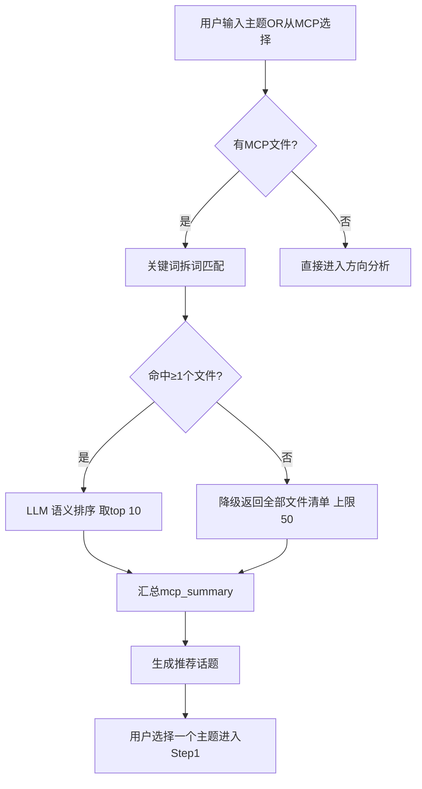
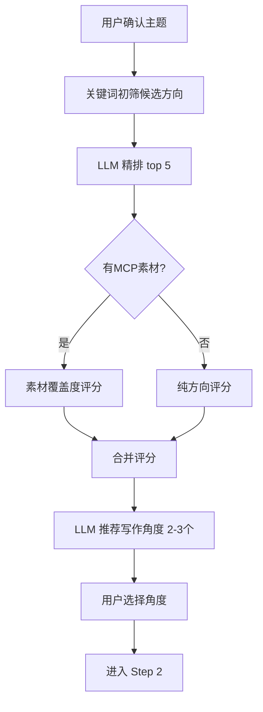
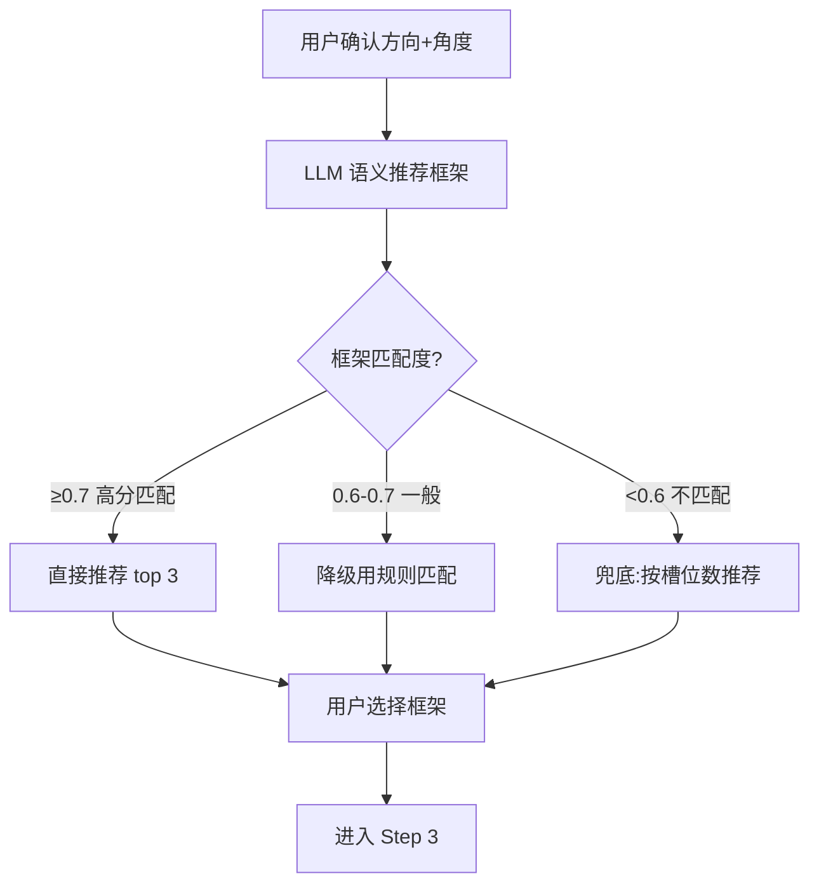
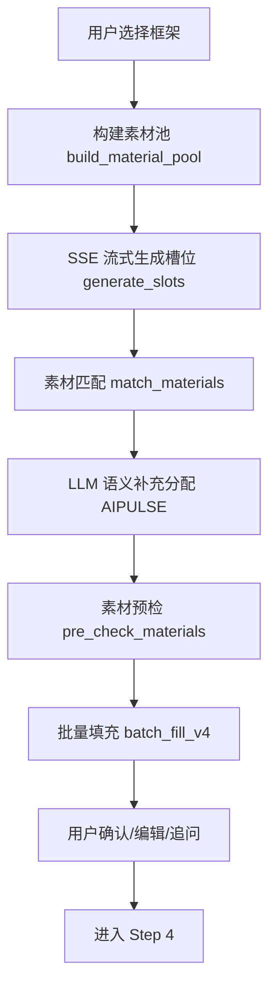
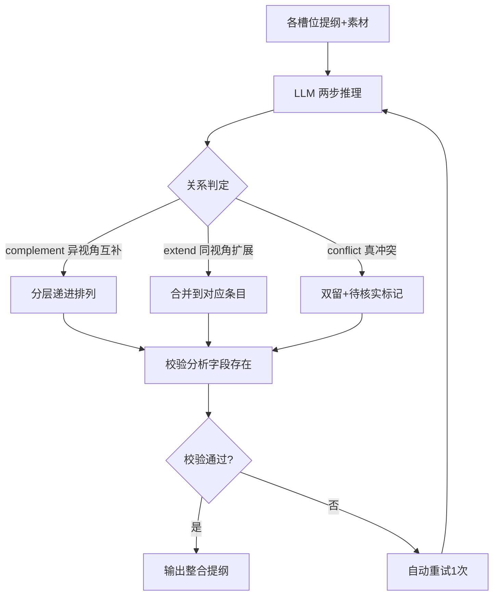
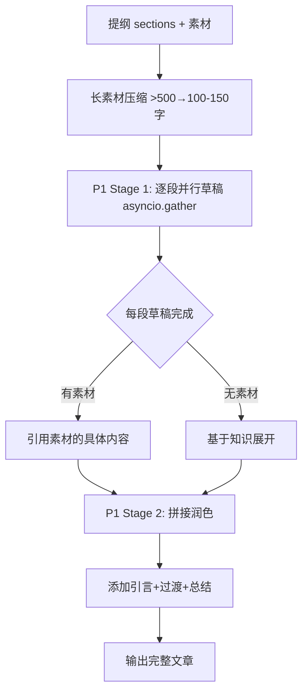

# ArchGen 内部执行逻辑定义 v3.1

> **交付对象：** Trae / 开发 AI  
> **用途：** 精确指导每个步骤的内部执行逻辑，无需猜测和自行设计  
> **对应版本：** ArchGen v3.0（2026-07-07 冻结）  
> **接口层已锁定，本文件只定义"内部怎么做"**

---

## 📋 目录

1. [通用规则](#1-通用规则)
2. [Step 0：选题发现](#2-step-0选题发现)
3. [Step 1：方向分析](#3-step-1方向分析)
4. [Step 2：框架匹配](#4-step-2框架匹配)
5. [Step 3：槽位分析](#5-step-3槽位分析)
6. [Step 4：提纲整合](#6-step-4提纲整合)
7. [Step 5：文章生成](#7-step-5文章生成)
8. [补充系统：AI 补充](#8-补充系统ai-补充)
9. [补充系统：素材池](#9-补充系统素材池)
10. [身份定位系统](#10-身份定位系统)
11. [日志与调试](#11-日志与调试)

---

## 1. 通用规则

### 1.1 Session 状态管理

所有 Step 共享同一个 Session 对象（内存 Dict），前端通过 `session_id` 引用。

```python
session = {
    "session_id": str,
    "created_at": float,
    "mcp_summary": str,        # MCP 素材摘要
    "mcp_files": list,         # MCP 文件列表
    "material_pool": list,     # 统一素材池（多来源合并）
    "aipulse_status": str,     # AI-Pulse 预拉状态: idle|fetching|done|empty|failed|disabled
    "aipulse_items": list,     # AI-Pulse 预拉结果列表
    "aipulse_items_count": int,
    "step1": dict,             # 方向分析结果
    "step2": dict,             # 框架+补充结果
    "confirmed_slots": list,   # 确认的槽位
    "slot_outlines": dict,     # 槽位提纲
    "slot_materials": dict,    # 槽位素材
    "outline": dict,           # 最终提纲
    "article": dict,           # 最终文章
    "thinking_logs": list,     # AI 思考日志
    "persona_summary": str,    # 身份定位摘要（缓存）
}
```

### 1.2 LLM 调用规范

所有 LLM 调用统一入口，但当前不强制使用 `stream_llm_call` 工具。每个调用必须：

1. 设置 `seed=42` 保证同输入同输出（调试友好）
2. 捕获异常并降级（不能让 LLM 失败导致整个流程崩溃）
3. 记录 thinking_logs（异步增量拉取）
4. Prompt 末尾强制要求 `不要 markdown 代码块`，或后处理 strip

### 1.3 错误处理策略

| 故障类型 | 处理方式 | 用户提示 |
|---------|---------|---------|
| LLM 超时 (60s+) | 重试 1 次 → 降级 fallback | "LLM 响应超时，请重试" |
| LLM 返回格式错误 | 后处理清洗（strip/regex 去 markdown 标记）→ JSON 解析失败→ 降级 | "AI 返回格式异常，已自动重试" |
| AI-Pulse API 不可用 | 静默跳过，不影响主流程 | 不提示（降级对用户透明） |
| 知识库文件不存在 | 返回空列表，不报错 | 不提示 |
| 素材池为空 | 跳过 LLM 调用的素材引用部分 | "暂无匹配素材"占位 |

---

## 2. Step 0：选题发现

### 2.1 内部逻辑



### 2.2 关键词匹配算法（`_match_materials_internal` 前身）

当用户在 MCPSearchView 选择主题时，做三步匹配：

```
输入: user_topic (用户输入的写作主题)
      files[] (知识库文件列表，每个含 name/path/content)

步骤1: 拆词
  └─ keywords = split(user_topic, delimiters=[， 、：: 空格])
  └─ 过滤: len(seg) >= 2
  └─ bigrams = [user_topic[i:i+2] for i in range(len-1)]  # 仅中文

步骤2: 打分
  └─ 每个文件:
      score  = 0
      score += len(matched_keyword) * 3    # 完整关键词命中
      score += 4 per matched_bigram        # 双字词命中
      score += overlap_ratio * 15  if overlap_ratio >= 0.25  # 单字重叠度

步骤3: 排序 + 截断
  └─ sort by score desc
  └─ limit to 30 篇
  └─ 对每篇截取 content[:3000] 返回给前端

降级策略:
  └─ 0 篇匹配 → 返回全部文件清单（limit 50，不读 content）
```

### 2.3 接口

| 接口 | 方法 | 说明 |
|------|------|------|
| `/api/mcp/suggest` | POST | MCP 题材推荐：分析这批资料适合写什么题材 |
| `/api/mcp/match-files` | POST | 按主题匹配文件并返回内容（纯关键词匹配，不调 LLM） |
| `/api/mcp/search` | POST | MCP 检索：扫描→过滤→读取→LLM 总结 |

---

## 3. Step 1：方向分析

### 3.1 内部逻辑



### 3.2 方向评分规则

```
输入: user_topic + mcp_summary + all_directions[12个候选]

阶段1: 关键词初筛
  └─ 从 mcp_summary 提取关键词（jieba 分词）
  └─ 每个方向计算关键词密度分数
  └─ 过滤: score < 0.2 → 排除，保留最多 10 个方向

阶段2: LLM 精排
  └─ 调用 LLM 对候选方向评分（0.2-1.0）
  └─ 评分标准:
      0.8-1.0: 强烈推荐（资料非常充足）
      0.6-0.8: 推荐（资料较充足）
      0.4-0.6: 可以考虑（资料一般）
      0.2-0.4: 不太适合（资料较少）
  └─ 返回格式: [{"name": "方向名", "score": 0.85, "reason": "...", "confidence_label": "强烈推荐"}]

阶段3: 覆盖度评分（direction_score = LLM评分 * 素材覆盖系数）
  └─ 素材覆盖系数 = 该方向匹配的素材数 / 总素材数
  └─ 最终排序按 direction_score desc

阶段4: 建议写作角度
  └─ 基于选题+素材，LLM 推荐 2-3 个写作角度
  └─ 每个角度含: 角度名、覆盖度、缺失素材项、匹配度评分
  └─ 触发时机: 用户选择方向后自动调用 angle/recommend
```

### 3.3 角度推荐的内部推理步

```
步骤1: 素材扫描——扫描 session 中所有素材，提取与方向相关的文本片段
步骤2: 覆盖度评分——每个候选角度的素材覆盖度（已有哪些素材，缺哪些）
步骤3: 人设匹配——根据身份定位(persona)的六维模型，评分角度与作者身份的吻合度
步骤4: 最终得分 = 覆盖度 * 0.6 + 人设匹配度 * 0.4
步骤5: 输出 top 2-3 角度，附带缺失项列表
```

### 3.4 AI-Pulse 预拉取（异步，Step 1 触发）

```
触发时机: 用户选择方向后，supplement_1 端点调用时

执行逻辑:
  └─ 异步任务（asyncio.create_task），不阻塞响应
  └─ 参数: keywords=[direction[:50]], days=30, take=20
  └─ 源: AI-Pulse API (8.130.148.166:8887)
  └─ 状态写入 session["aipulse_status"]:
      - idle → fetching → done | empty | failed | disabled
  └─ 前端通过 GET /api/workflow/aipulse_status/{session_id} 轮询

降级策略:
  └─ days=30 无结果 → 降级为 time_filter=month（生产端 week 无数据）
  └─ API 不可用 → 静默失败，显示为 disabled
  └─ 关键词不匹配返回 0 条 → 显示为 empty
```

### 3.5 接口

| 接口 | 方法 | 说明 |
|------|------|------|
| `/api/workflow/directions/analyze` | POST | 推荐写作方向（带缺失项展示） |
| `/api/workflow/directions/evaluate` | POST | 评估用户自定义方向 |
| `/api/workflow/angle/recommend` | POST | 写作角度推荐（多步推理） |
| `/api/workflow/supplement/1` | POST | 第1次补充 + 后台预拉 AIPULSE |
| `/api/workflow/aipulse_status/{id}` | GET | 查询 AIPULSE 预拉取状态 |

---

## 4. Step 2：框架匹配

### 4.1 内部逻辑



### 4.2 双评分机制

```
评分1: LLM 语义评分（align_score）
  └─ LLM 判断框架与方向+素材+人设的匹配程度
  └─ 0.0-1.0

评分2: 业务化检测（biz_score）
  └─ 检查框架是否适合"商业实战"场景
  └─ 规则: 
      - 有案例支撑 +0.2
      - 有数据要求 +0.1
      - 有可操作步骤 +0.2
      - 纯理论框架 -0.3

最终分 = align_score * 0.7 + biz_score * 0.3

降级条件:
  └─ align_score < 0.5 → 完全规则匹配（不调 LLM）
  └─ 0.5 <= align_score < 0.7 → 规则匹配 + LLM 补充建议
  └─ align_score >= 0.7 → 纯 LLM 推荐
```

### 4.3 前端展示逻辑

每个推荐的框架卡片显示：
- 框架名 + key（如 SWOT / 时间线 / 对比分析）
- 匹配度分数（百分制）
- 匹配理由（LLM 输出）
- 业务化 warning（如果有，如"该框架偏理论，建议结合具体案例使用"）

### 4.4 接口

| 接口 | 方法 | 说明 |
|------|------|------|
| `/api/workflow/frameworks/match` | POST | 推荐分析框架（双评分+降级兜底） |
| `/api/frameworks` | POST | 获取所有框架定义 |
| `/api/frameworks/detail/{key}` | GET | 获取框架详情 |
| `/api/framework/suggest-from-slots` | POST | V4: 从槽位结构推荐配图框架类型 |

---

## 5. Step 3：槽位分析

### 5.1 整体流程



### 5.2 素材池构建（`_ensure_material_pool`）

6 层追加，严格顺序，加法不覆盖：

```
第1层: MCP Summary（文本块）
  └─ source_type = "mcp_summary"
  └─ 追加条件: mcp_summary 非空

第2层: MCP Files（知识库文件）
  └─ source_type = "knowledge_base"
  └─ 每个文件: {text, source_type, filename}

第3层: 磁盘补充内容（supplement_storage JSON）
  └─ source_type = 原始 source 字段
  └─ 文件路径: data/supplements/{session_id}.json

第4层: 前端 Step 1 补充素材（session["step2"]["supplement_2"]）
  └─ 4a: 知识库文件 → source_type = "knowledge_base"
  └─ 4b: AI 补充素材 → source_type = "ai_inferred"
  └─ 4c: 补充文本 → source_type = "user_input"

第5层: AIPULSE 预拉结果（session["aipulse_items"]）
  └─ source_type = "aipulse"
  └─ 追加条件: aipulse_items 非空

第6层: 去重（3 步）
  └─ 6a: text 前 200 字符精确去重
  └─ 6b: SequenceMatcher 标题相似度 > 0.6 去重
  └─ 6c: 保留先入池的，删除后入池的

输出: session["material_pool"] = deduped_list
```

### 5.3 槽位生成（`generate_slots` - SSE 流式）

```
输入: session_id + topic + material_pool_summary

Prompt 结构:
  ┌─ 创作主题
  ├─ 素材统计（总数 / 文件数 / AI 补充数 / 素材概览）
  └─ 要求:
      1. 设计 4-8 个槽位
      2. 逻辑递进关系（从浅入深/从现象到本质）
      3. 每个槽位名称 2-6 个字，描述 10 字以内
      4. 输出 thinking（100-200 字，含素材统计引用）

输出格式:
  { "thinking": "...", "slots": [{"slot_key", "label", "description"}] }

SSE 事件流:
  1. "started" → 连接建立
  2. "thinking" → LLM 思考过程
  3. "done" → 完整槽位列表
  4. "error" → 错误信息
  心跳: 每 2 秒发送 ": heartbeat\n\n"（防止前端断开）

保存: session["confirmed_slots"] = slots
```

### 5.4 素材匹配（`_match_materials_internal`）

```
输入: session_id + confirmed_slots[slot_key/label/desc] + 可选 search_keywords

算法: 三轮打分

  ┌─ 特征1: 完整分词匹配
  │    从 label+desc 提取完整词（分隔符: 中文标点+空格）
  │    每个匹配: score += len(kw) * 3
  │
  ├─ 特征2: 中文双字词（bigram）
  │    每相邻两中文字符为一个 bigram
  │    每个匹配: score += 4
  │
  └─ 特征3: 单字重叠度
      同槽位与素材中文字符集的交集 / 槽位中文字符集
      阈值: overlap_ratio >= 0.25
      score += int(overlap_ratio * 15)

匹配片段: 提取命中位置前后 80 字作为 snippet

输出: { slot_key: [{text, source_type, filename, score, match_snippet}] }

去重: SequenceMatcher > 0.8 标记 is_duplicate
```

### 5.5 AI-Pulse LLM 语义分配（`_match_aipulse_by_llm`）

```
触发时机: batch_fill_v4 中，关键词匹配之后

输入: session_id + confirmed_slots + slot_materials
执行条件: material_pool 中有 source_type="aipulse" 的素材

Prompt:
  ┌─ 列出所有槽位 (slot_key + label + desc)
  ├─ 列出所有 AIPULSE 素材 (index + title + text[:150])
  └─ 要求: 将素材分配到最相关的槽位

输出格式: { "assignments": { "slot_key1": [0, 2, 5], ... } }
  └─ key=slot_key, value=素材索引数组

降级: LLM 调用失败时，保留关键词匹配的结果不变
```

### 5.6 批量填充（`batch_fill_v4`）

```
步骤1: 联网兜底（可选）
  └─ 用户手动开启 web_search_enabled
  └─ 搜索词: topic[:60] + 每个槽位 label
  └─ 最多 3 个搜索词，每词 4 条结果
  └─ 结果追加到 material_pool
  └─ 失败不中断主流程

步骤2: 第一轮素材匹配
  └─ 调用 _match_materials_internal (用 label+desc)

步骤3: 逐槽位生成提纲（for 循环）
  └─ 输入: slot的label/desc + 匹配素材[:5]
  └─ 输出: outline[3-5个要点] + search_keywords[3-5个]
  └─ 失败: 跳过该槽位的提纲生成

步骤4: 第二轮素材匹配
  └─ 调用 _match_materials_internal (用 label+desc+search_keywords)
  └─ 精度更高

步骤5: AIPULSE LLM 语义分配
  └─ 调用 _match_aipulse_by_llm

输出: { slot_materials, slot_outlines }
  └─ slot_materials: { slot_key: [{text, source_type, filename, score, match_snippet}] }
  └─ slot_outlines: { slot_key: [{order, point}] }
```

### 5.7 槽位追问与编辑

```
追问 AI (ask_followup):
  └─ 场景: 用户对某个槽位内容不满意，追问更多信息
  └─ 输入: slot_key + 槽位当前内容 + 用户追问 + 历史对话
  └─ 输出: AI 补充回答
  └─ 对话历史: session[slot_ask_history] = [{role, content}]

槽位分析 (analyze):
  └─ 场景: 对某个槽位的素材做深度分析
  └─ 输入: slot_key + 该槽位素材列表
  └─ 输出: 素材分类/质量评分/覆盖度分析/补充建议
  └─ 与 ask_followup 的区别:
      - ask_followup: 用户问任何问题，AI 自由回答（无结构）
      - analyze: 严格按结构输出分析报告（固定格式）
```

### 5.8 接口

| 接口 | 方法 | 说明 |
|------|------|------|
| `/api/workflow/slot/build_material_pool` | POST | V4 素材池统一构建 |
| `/api/workflow/slot/generate_slots` | POST | V4 SSE 流式槽位生成 |
| `/api/workflow/slot/slot_relations` | POST | V4 生成槽位间关系图谱 |
| `/api/workflow/slot/match_materials` | POST | V4 素材匹配 |
| `/api/workflow/slot/pre_check_materials` | POST | V4 素材可行性预检 |
| `/api/workflow/slot/content_preview` | POST | 槽位内容预览 |
| `/api/workflow/slot/batch_fill_v4` | POST | V4 批量填充 |
| `/api/workflow/slot/generate_outline` | POST | V4 生成单个槽位提纲 |
| `/api/workflow/slot/ask_followup` | POST | V4 追问 AI |
| `/api/workflow/slot/analyze` | POST | H3 槽位素材分析 |
| `/api/workflow/slot/web_search` | POST | 按槽位联网搜索补充素材 |

---

## 6. Step 4：提纲整合

### 6.1 内部逻辑



### 6.2 三步推理 Prompt

```
Step 1: 理解层（analysis 输出）
  ┌─ 提取当前提纲的核心主题（old_theme）
  └─ 提取每条提纲的视角（old_perspectives）

Step 2: 分析层（analysis 输出）
  ┌─ 分析素材能提供什么新维度（new_dimensions）
  └─ 每条标 relation:
      - complement: 异视角互补（如"闭坑经验"+"技术趋势"）
      - extend: 同视角扩展（如"闭坑经验"+"新增案例"）
      - conflict: 结论相反，需待核实

Step 3: 编排层（points 输出）
  └─ complement → 分层递进排列（先旧视角→新视角→融合落地）
  └─ extend → 合并到对应旧条目
  └─ conflict → 两条保留，弱势方标注 [待核实]
```

### 6.3 输出格式

```json
{
  "thinking_chain": [
    {"step": 1, "action": "分析当前提纲", "reason": "...", "result": "..."},
    {"step": 2, "action": "分析补充素材", "reason": "...", "result": "..."},
    {"step": 3, "action": "编排提纲", "reason": "...", "result": "..."}
  ],
  "points": [
    {"order": 1, "point": "要点内容", "from": "旧视角A"},
    {"order": 2, "point": "要点内容", "from": "新维度B"}
  ],
  "result": "整合后的完整提纲要点文本"
}
```

### 6.4 校验规则

```
校验1: thinking_chain 必须 ≥ 3 步
校验2: points 必须包含 from 字段，对应 analysis 中识别的关系
校验3: analysis 字段必须存在（前端展示用）
校验4: 不得丢弃任何输入提纲条目（除非完全重复）

不通过: 自动重试 1 次，仍失败则返回旧提纲 + warning
```

### 6.5 接口

| 接口 | 方法 | 说明 |
|------|------|------|
| `/api/workflow/slot/integrate_outline` | POST | 将提纲碎片+素材整合为连贯提纲 |

---

## 7. Step 5：文章生成

### 7.1 内部逻辑



### 7.2 Stage 1：逐段独立草稿

```
并行: asyncio.gather，每个段落独立调用 LLM

输入:
  ┌─ 段落主题 (title)
  ├─ 段落要点 (key_points)
  ├─ 该段落专属素材 (materials[:5])
  │   └─ >500字的素材先压缩成100-150字摘要
  └─ 全局上下文（方向/框架/人设/补充信息）

Prompt 要求:
  ┌─ 专注于本段主题，充分展开
  ├─ 必须引用素材中的具体内容（案例、数据、观点）
  ├─ 理论≤20%，实战≥80%
  ├─ 长度: 500-1200 字
  └─ 段落末尾自然留口，方便下一段衔接

输出: { title, content, word_count }
```

### 7.3 长素材压缩（`_summarize_long_material`）

```
触发条件: len(text) > 500
目标: 压缩至 100-150 字
策略:
  ┌─ 保留核心事实、数据、结论
  ├─ 丢弃修饰性语言
  └─ 失败时 text[:500] + "（...截断）"

调用方式: 独立 LLM 调用，temperature=0.1
```

### 7.4 Stage 2：拼接润色

```
输入: 所有段落草稿 + 全局上下文

任务:
  1. 按段落顺序排列
  2. 段落之间添加自然过渡句
  3. 添加标题（吸引人）
  4. 添加引言（2-3 句，说明问题/价值）
  5. 添加总结（2-3 句，升华主题）
  6. 不删减具体案例和数据
  7. 保持语言风格统一

输出: { title, paragraphs: [{title, content, word_count}] }
```

### 7.5 框架 key 映射

```
目的: 前端配图需要 framework_key
映射规则:
  1. 如果框架对象有 key → 直接使用
  2. 否则在所有框架定义中按 name 匹配
  3. 未匹配 → framework.lower().replace(" ", "_")[:30]
结果存入 article["framework_key"]
```

### 7.6 接口

| 接口 | 方法 | 说明 |
|------|------|------|
| `/api/workflow/article/generate` | POST | 基于提纲生成完整文章 |
| `/api/content/pipeline/generate` | POST | P2 4 阶段 LLM Pipeline 生成 |
| `/api/content/pipeline/full_workflow` | POST | P2 完整 4 阶段工作流 |

---

## 8. 补充系统：AI 补充

### 8.1 知识评估五级体系

| 等级 | 含义 | 输出策略 | 重新评估? |
|------|------|---------|-----------|
| L0 | 知识充足 | 补充具体内容+案例/数据 | ✅ 重新评估 |
| L1 | 知识部分 | 补充通用模式（缺少具体案例） | ✅ 重新评估 |
| L2 | 知识稀疏 | 提出结构化问题（不补充内容） | ❌ 不重新评估 |
| L3 | 几乎没有 | 类比推导 | ❌ 不重新评估 |
| L4 | 知识空白 | 空框架 | ❌ 不重新评估 |

### 8.2 降级链逻辑

```
用户第1次点击"补充" → L0/L1: 补充内容 + 重新评估
用户对结果不满意 → L2: 提问题（不补充内容）
用户仍不满意 → L3: 类比推导
用户还不满意 → L4: 框架占位
即使不满意 → 不再降级（2 次降级上限）

前端展示:
  L0: 直接显示补充内容
  L1: 正常显示 + "注：缺少具体案例，建议手动补充"
  L2: 显示结构化问题列表 + "AI 知识有限，以下问题可帮助您完善"
  L3: 显示类比推导 + "⚠️ AI 基于类比推导"
  L4: 显示框架 + "⚠️ AI 对此领域了解有限"
```

### 8.3 三来源补充

补充对话框提供三种来源：

```
来源1: 知识库文件（📂）
  └─ 用户从知识库选择文件
  └─ 后端读取 content[:3000]
  └─ source_type = "knowledge_base"

来源2: 联网搜索（🌐）
  └─ 用户输入搜索关键词
  └─ 调用 AI-Pulse API 检索 7 天内容
  └─ 或调用 DuckDuckGo（web_search.py）
  └─ source_type = "web_search"

来源3: 手动输入（📝）
  └─ 用户自由输入文本
  └─ source_type = "user_input"
```

### 8.4 接口

| 接口 | 方法 | 说明 |
|------|------|------|
| `/api/workflow/supplement/ai-auto` | POST | AI 自动补充（整合多源） |
| `/api/workflow/supplement/ai-infer` | POST | AI 推断补充+匹配素材 |
| `/api/workflow/supplement/ai-pulse` | POST | AI-Pulse 补充 |
| `/api/workflow/supplement/add` | POST | 用户手动补充 |
| `/api/workflow/supplement/confirm` | POST | 确认补充内容 |
| `/api/workflow/supplement/list` | POST | 获取补充列表 |
| `/api/workflow/supplement/1/2/3` | POST | 分步补充 |
| `/api/workflow/supplement/smart` | POST | 智能补充（含知识评估） |
| `/api/workflow/supplement/degrade` | POST | 降级补充 |
| `/api/workflow/supplement/draft` | POST | 起草模式 |

---

## 9. 补充系统：素材池

### 9.1 素材池数据结构

```python
{
    "text": str,              # 素材正文（截断至 500 字）
    "source_type": str,       # mcp_summary | knowledge_base | user_input | ai_inferred | web_search | aipulse
    "filename": str,          # 来源文件名或素材名
    "source_name": str,       # 来源显示名（可选）
    "url": str,               # 来源链接（可选，如 AIPULSE 原文链接）
    "score": float,           # 原始质量分数（可选，如 AIPULSE 评分）
    "published_at": str,      # 发布时间（可选）
}
```

### 9.2 素材追加规则

```
加法原则: 只追加，不覆盖已有素材
触发时机:
  1. Step 3 进入时: build_material_pool
  2. 用户补充后: add/ai-infer 调用后自动追加
  3. AI-Pulse 预拉完成: 写入 session["aipulse_items"]

去重时机: 每次 _ensure_material_pool 调用时
去重字段:
  1. text[:200] 精确匹配 → 去重
  2. filename 相似度 > 0.6 (SequenceMatcher) → 去重（AIPULSE vs KB 重复）
```

### 9.3 前端视觉区分

| source_type | 卡片样式 | 图标 |
|-------------|---------|------|
| mcp_summary | 默认 | 📄 |
| knowledge_base | 蓝色边框 | 📂 |
| user_input | 绿色边框 | 📝 |
| ai_inferred | 橙色边框 | 🤖 |
| web_search | 灰色边框 | 🌐 |
| aipulse | 青色背景 | 📡 |
| 未匹配/无来源 | 虚线边框 | ⚪ |

---

## 10. 身份定位系统

### 10.1 Persona 六维模型

```
Who（受众画像）
  └─ 身份/角色
  └─ 痛点
  └─ 共情话术

Why（核心驱动）
  └─ 作者写作的核心动机

Voice（表达范式）
  └─ 风格: 专业/口语/故事性
  └─ 格式: 清单/案例/教程

Value（价值标准）
  └─ 什么样的内容才有价值

Filter（认知过滤）
  └─ 作者观点倾向/偏好/立场

Edge（能力边界）
  └─ 专注领域
  └─ 回避领域
```

### 10.2 加载机制

```
启动时:
  └─ 检查 persona.file_path 是否存在
  └─ 存在 → 读取文件内容
  └─ 调用 LLM 解析六维结构（POST /api/persona/parse）
  └─ 结果缓存到 session["persona_summary"]

运行时:
  └─ 所有 LLM prompt 注入 person 摘要（放在 prompt 最前面）
  └─ 方向推荐 + 角度推荐 + 框架匹配 + 文章生成全部受 person 影响

更新:
  └─ 用户修改 person 文件后，调用 POST /api/persona/save
  └─ 重新解析并更新全局缓存
```

### 10.3 接口

| 接口 | 方法 | 说明 |
|------|------|------|
| `/api/persona/parse` | POST | 解析身份定位文件 |
| `/api/persona/info` | GET | 获取身份定位信息 |
| `/api/persona/set_path` | POST | 设置文件路径 |
| `/api/persona/save` | POST | 保存内容到文件 |

---

## 11. 日志与调试

### 11.1 思考日志（Thinking Logs）

```python
thinking_log = {
    "call_id": str,            # 唯一标识
    "call_name": str,          # 调用名（如"槽位生成"）
    "phase": str,              # 阶段标识
    "session_id": str,         # 会话 ID
    "start_time": float,       # 开始时间戳
    "end_time": float,         # 结束时间戳
    "duration": float,         # 耗时（秒）
    "model": str,              # 模型名
    "temperature": float,      # 温度
    "status": str,             # success | failed
    "full_prompt": str,        # 完整 prompt（截断至 8000 字）
    "thinking_chain": list,    # 结构化思考链 [{step, action, reason, result}]
    "final_output": str,       # 最终输出（截断至 5000 字）
    "error": str,              # 错误信息（失败时）
    "log_id": str,             # 日志 ID
}
```

### 11.2 前端轮询机制

```
轮询端点: GET /api/workflow/thinking/logs?session_id=X&since=timestamp
轮询间隔: 每 2 秒
增量拉取: since 参数只返回该时间戳之后的日志
展示位置: ThinkingLogPanel.vue（右下角浮动）
展示内容: 实时调用日志 + 历史记录 + 详情展开
```

### 11.3 前端思考链展示

```
thinking_chain 数组 → 前端渲染为步骤列表
每步显示: step → action → reason → result
正在进行的调用: 显示 loading 状态
完成的调用: 显示耗时 + 结果摘要
```

---

## 附录 A：完整 Prompt 清单

各步骤的 LLM Prompt 模板，详见 `config/prompts.yaml`。

当前使用 **单体 LLM 架构**，通过 `stage` 参数区分不同 prompt：
- `router`: 方向推荐（注入 Edge）
- `logic_editor`: 逻辑编辑（注入 Why+Filter+Value）
- `extractor`: 内容萃取（注入 Who+Value）
- `generator`: 内容生成（注入 Voice+Who）

P2 目标：拆分为 4 个独立 LLM 调用（当前未实施）。

## 附录 B：限流与保护

| 策略 | 实现 | 触发条件 |
|------|------|---------|
| LLM 重试 | 自动重试 1 次 | 超时/HTTP 错误 |
| LLM 超时 | 120s timeout + 10s connect | 每次调用 |
| 素材截断 | 每素材 ≤500 字 | 写入素材池时 |
| Session 清理 | 30 天自动过期 | 定时任务 |
| 降级上限 | 2 次 / 单个缺失项 | degrade_supplement |
